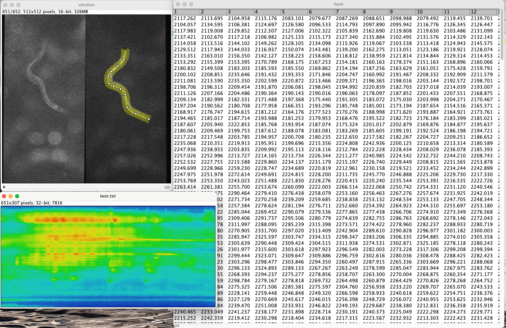

# ReadMe

This small script make a heatmap of plot profile from time lapse data. 

## How to use
1. Open your stack file
2. Select ROI using line tool
3. Run this script. It will ask you a directory for save
4. The script will show a heatmap and save to the designated directory

